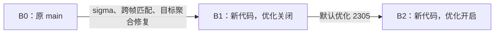

# NSSFactory worktree 合并与全算法 C4 A/B 报告（2026-09-06）

## 结论

合并已完成。**优化本身保持输出逐位一致，具有重复样本的23类配置未检出超过2%的性能退化；但从旧主仓库直接迁移，确实存在时域性能成本和相同数值sigma下的质量变化。**

- 八算法常用1080p配置的速度点估计为旧版的 **0.993–1.021×**，其置信区间未指向超过2%的退化。默认BM3D b8/g8 Basic、Wiener和完整链路基本持平。
- 同语义B1→B2：BM3D空间g16/g32完整链路 **1.663× / 1.726×**；NLH运动r1 **2.166×**；WNNM/TWSC/NCSR g32约 **1.027× / 1.028× / 1.032×**。
- 同语义rolling chunk2顺序/随机为 **1.103× / 1.089×**；1080p chunk8为 **1.141×，仅一对，属于诊断性结果**。本次工作进程峰值RSS未体现显著下降。
- 旧版B0→B2：运动r1的BM3D、WNNM、TWSC、NCSR耗时分别增加约 **21.5%、19.1%、4.6%、5.5%**；rolling chunk2顺序/随机耗时约增加 **111%、101%**。这是实际迁移成本，不能被优化开关的提速掩盖。
- 在固定3/255噪声的本样本上，空间g16/g32的PSNR(clean)下降约 **1.35 dB**；将新版本sigma由3补偿到4后，两者都**逐位恢复旧版sigma=3的输出**。时域运动样本PSNR(clean)提升 **9.3–16.4 dB**；静态1080p rolling chunk8则变化 **-1.259 dB**。

上述“超过2%”使用耗时阈值，等价于加速比下界不低于1/1.02。单对样本不用于确认稳定性。

## 版本与合并范围

| 版本 | 定义 | 插件 SHA256 |
|---|---|---|
| B0 | 合并前 main `80bbaee` | `2e1e72f52dcc6a89250dee04689003869eb874d5222895d5e73d9f37c79d71de` |
| B1 | 新代码，`NSS_BM_EXPERIMENT=0`，含 sigma/时域正确性修复 | `9195f9512307b99c01a88422f46d9165eba6e7be347d28f54e12c09fb427105d` |
| B2 | 新代码，默认 `2305`：SortedTopK、缓冲复用、rolling ring/scratch | `d460e44630e396361e6652bb44c0c2e0085a253e0a0a9d3a0caa22caa46787e8` |

运行时代码及初始测量驱动来自 `288b7be`。之后的提交仅补充测试、PMU 驱动及报告；最终运行时代码与构建输入另做哈希核对。

盘点的五个 worktree 全部归入 main 的提交历史，未提交源码均已保存。正确性工作树提交 `df23068` 通过 `e7b425e` 合并；两个旧实验快照 `532e7f1`、`df2fbfc` 通过 `415207c` 保留历史。旧 shortlist 实验此前已因质量问题被拒绝，旧 b4 和 benchmark 代码已被主仓库后续实现覆盖，因此没有用旧文件覆盖新实现。详见 [旧实验结论](../artifacts/c4/bm3d-four-priorities-20260904-a1/analysis.md) 与 [worktree 清单](../artifacts/c4/integration-20260906/worktrees-after.json)。工作树目录保留为干净的历史检出。

## 方法与覆盖

- 两台 `c4-highcpu-2` Spot，均在 `me-west1-b`，Emerald Rapids，使用对应的已验证区域快照。A/B 与 PMU 分机执行；每个对照内部始终同机，不混合跨机时间。
- GCC 13.3、CMake 3.28.3、VapourSynth R75、NumPy 2.5.2、Highway 1.4.0。动态 Highway 派发；热点记录显示 AVX3。本轮不声称 AVX2-only 性能结果。
- 固定 CPU0，CPU1 为闲置 SMT sibling；检查 CPU1 idle≥99.9% 和 steal=0。OpenMP/OpenBLAS/VapourSynth 工作线程数为 1。
- 八算法常用配置使用 MAPPA 1920×1080 图像加固定 3/255 噪声；MCWNNM 为同一底图的三通道独立噪声。时域输入为周期平移加逐帧独立噪声，320×180；共享 g32 为640×360；另补1080p rolling chunk8。较小尺寸由明确的最近邻采样生成。
- NLM 使用 d=1；其它常用配置 radius=0。BM3D 的常用配置表项为 Basic，另外单列 Wiener（ref=source）和 Basic→Final 完整链路。NLH 的一次 API 调用包含其内部处理阶段。
- A/B 交替顺序，组预算45秒，复测60秒；自动校准共同帧数。输入在计时前物化并保留，帧请求区间计时，输出哈希在计时后计算。整个预算包含工作进程启动、热身、校准和输出处理，不含之后的报告统计。超时的未完成配对丢弃；不以空等补足30秒。
- 表中 A/B>1 表示 B 更快。加速比是配对比值的中位数，CI 为10,000次固定种子的配对 bootstrap；A/B 各自的 ms 中位数相除不一定恰好等于配对中位数。单对样本的零宽 CI 不代表高置信度。
- MCWNNM 主组为一对3帧样本；主表采用额外正反顺序的六对1帧复测，以免混合不同长度。BM3D 原版 Basic/完整链路及 TWSC g32 优化开关采用60秒复测；初始结果保留在 final-analysis.json，未删除不利样本。

## B0 → B2：用户实际迁移的速度变化

| 配置 | 尺寸 | A ms/frame | B ms/frame | A/B | 95% CI | 对数 | 环境 |
|---|---|---:|---:|---:|---|---:|---|
| nlm_1080 | 1920×1080 | 143.797 | 142.334 | 1.00995× | [1.00689, 1.01770] | 7 | 通过 |
| bm3d_1080 | 1920×1080 | 88.373 | 88.437 | 0.99929× | [0.98145, 1.01363] | 5 | 通过 |
| wnnm_1080 | 1920×1080 | 159.661 | 158.905 | 1.00631× | [1.00086, 1.00880] | 7 | 通过 |
| twsc_1080 | 1920×1080 | 328.710 | 327.747 | 1.00316× | [1.00199, 1.00506] | 7 | 通过 |
| ncsr_1080 | 1920×1080 | 330.285 | 331.661 | 0.99337× | [0.98825, 1.00160] | 7 | 通过 |
| lssc_1080 | 1920×1080 | 421.048 | 419.102 | 1.00505× | [1.00378, 1.00770] | 7 | 通过 |
| nlh_1080 | 1920×1080 | 1998.406 | 1950.212 | 1.02126× | [1.00167, 1.04242] | 3 | 通过 |
| mcwnnm_1080 | 1920×1080 | 2759.322 | 2759.031 | 1.00058× | [1.00011, 1.00159] | 6 | 通过 |
| bm3d_g16_chain | 1920×1080 | 1013.661 | 613.502 | 1.65251× | [1.65132, 1.65460] | 7 | 通过 |
| bm3d_g32_chain | 1920×1080 | 1956.023 | 1150.529 | 1.69993× | [1.69858, 1.70185] | 3 | 通过 |
| bm3d_motion_r1 | 320×180 | 8.143 | 9.900 | 0.82273× | [0.80968, 0.82636] | 7 | 通过 |
| wnnm_motion_r1 | 320×180 | 5.733 | 6.842 | 0.83968× | [0.83773, 0.84665] | 7 | 通过 |
| twsc_motion_r1 | 320×180 | 13.381 | 13.996 | 0.95587× | [0.95435, 0.96313] | 7 | 通过 |
| ncsr_motion_r1 | 320×180 | 13.057 | 13.779 | 0.94779× | [0.94398, 0.95370] | 7 | 通过 |
| nlh_motion_r1 | 320×180 | 123.054 | 57.951 | 2.12497× | [2.12038, 2.13231] | 7 | 通过 |
| mcwnnm_motion_r1 | 320×180 | 91.610 | 90.440 | 1.01237× | [1.01169, 1.01357] | 7 | 通过 |
| bm3d_rolling_sequential | 320×180 | 7.893 | 16.555 | 0.47347× | [0.47339, 0.47787] | 7 | 通过 |
| bm3d_rolling_random | 320×180 | 28.536 | 57.425 | 0.49673× | [0.49640, 0.49702] | 4 | 通过 |
| wnnm_g32 | 640×360 | 1696.712 | 1650.803 | 1.02781× | [1.01395, 1.03156] | 3 | 通过 |
| twsc_g32 | 640×360 | 2564.234 | 2470.830 | 1.03780× | [1.03780, 1.03780] | 1 | 通过 |
| ncsr_g32 | 640×360 | 2512.710 | 2437.721 | 1.03059× | [0.99959, 1.04102] | 3 | 通过 |
| bm3d_g8_wiener_1080 | 1920×1080 | 92.631 | 92.625 | 0.99795× | [0.99556, 1.00093] | 4 | 通过 |
| bm3d_g8_chain_1080 | 1920×1080 | 155.951 | 156.426 | 0.99909× | [0.99645, 1.01276] | 5 | 通过 |
| bm3d_rolling_chunk8_1080 | 1920×1080 | 319.585 | 411.960 | 0.77577× | [0.77577, 0.77577] | 1 | 通过 |

## B1 → B2：排除语义变化后的优化收益

| 配置 | 尺寸 | A ms/frame | B ms/frame | A/B | 95% CI | 对数 | 环境 |
|---|---|---:|---:|---:|---|---:|---|
| nlm_1080 | 1920×1080 | 176.546 | 174.310 | 1.01846× | [0.99813, 1.03429] | 5 | 通过 |
| bm3d_1080 | 1920×1080 | 84.818 | 85.317 | 0.99805× | [0.99328, 1.00663] | 6 | 通过 |
| wnnm_1080 | 1920×1080 | 151.061 | 151.266 | 0.99911× | [0.99810, 1.00650] | 7 | 通过 |
| twsc_1080 | 1920×1080 | 318.700 | 317.459 | 1.00818× | [1.00082, 1.02857] | 7 | 通过 |
| ncsr_1080 | 1920×1080 | 323.051 | 321.711 | 1.00193× | [0.99928, 1.00907] | 7 | 通过 |
| lssc_1080 | 1920×1080 | 416.657 | 416.681 | 0.99730× | [0.99599, 1.00222] | 7 | 通过 |
| nlh_1080 | 1920×1080 | 1949.296 | 1986.019 | 1.00143× | [0.98151, 1.00156] | 3 | 通过 |
| mcwnnm_1080 | 1920×1080 | 2737.754 | 2723.441 | 1.00159× | [0.98909, 1.01621] | 6 | 通过 |
| bm3d_g16_chain | 1920×1080 | 993.730 | 596.967 | 1.66282× | [1.66005, 1.66824] | 7 | 通过 |
| bm3d_g32_chain | 1920×1080 | 1907.418 | 1113.022 | 1.72618× | [1.70603, 1.72727] | 3 | 通过 |
| bm3d_motion_r1 | 320×180 | 10.242 | 9.784 | 1.06363× | [1.05853, 1.06795] | 7 | 通过 |
| wnnm_motion_r1 | 320×180 | 7.025 | 6.928 | 1.01862× | [1.00839, 1.02037] | 7 | 通过 |
| twsc_motion_r1 | 320×180 | 14.314 | 14.165 | 1.01112× | [1.00930, 1.01881] | 7 | 通过 |
| ncsr_motion_r1 | 320×180 | 14.147 | 14.127 | 1.00064× | [0.99492, 1.00506] | 7 | 通过 |
| nlh_motion_r1 | 320×180 | 128.700 | 59.433 | 2.16562× | [2.16229, 2.16748] | 7 | 通过 |
| mcwnnm_motion_r1 | 320×180 | 89.657 | 89.426 | 1.00228× | [1.00053, 1.00509] | 7 | 通过 |
| bm3d_rolling_sequential | 320×180 | 18.823 | 17.101 | 1.10289× | [1.09820, 1.10761] | 7 | 通过 |
| bm3d_rolling_random | 320×180 | 62.760 | 57.688 | 1.08935× | [1.07587, 1.09328] | 4 | 通过 |
| wnnm_g32 | 640×360 | 1717.918 | 1677.792 | 1.02687× | [1.02320, 1.03065] | 3 | 通过 |
| twsc_g32 | 640×360 | 2598.158 | 2526.191 | 1.02849× | [1.02500, 1.04749] | 3 | 通过 |
| ncsr_g32 | 640×360 | 2408.386 | 2335.222 | 1.03177× | [1.03133, 1.03635] | 3 | 通过 |
| bm3d_g8_wiener_1080 | 1920×1080 | 97.604 | 97.637 | 0.99966× | [0.98379, 1.00825] | 4 | 通过 |
| bm3d_g8_chain_1080 | 1920×1080 | 155.184 | 154.245 | 1.00034× | [0.98268, 1.00787] | 5 | 通过 |
| bm3d_rolling_chunk8_1080 | 1920×1080 | 413.561 | 362.503 | 1.14085× | [1.14085, 1.14085] | 1 | 通过 |

## 输出误差

以下最大误差、RMSE和PSNR(A,B)来自每组第一完整配对的前至多7帧；所有计时帧另做 SHA256 校验。PSNR(A,B)衡量实现之间的差异，不是相对干净图像的质量。B1→B2 的独立230项数值矩阵及本表各配置均逐位一致。

| 配置 | 原版→新版最大误差 | RMSE | PSNR(A,B) dB | 优化关闭→开启最大误差 | 全时段哈希相同 |
|---|---:|---:|---:|---:|---|
| nlm_1080 | 0 | 0 | inf | 0 | 是 |
| bm3d_1080 | 0 | 0 | inf | 0 | 是 |
| wnnm_1080 | 0 | 0 | inf | 0 | 是 |
| twsc_1080 | 0 | 0 | inf | 0 | 是 |
| ncsr_1080 | 0 | 0 | inf | 0 | 是 |
| lssc_1080 | 0 | 0 | inf | 0 | 是 |
| nlh_1080 | 0 | 0 | inf | 0 | 是 |
| mcwnnm_1080 | 0 | 0 | inf | 0 | 是 |
| bm3d_g16_chain | 0.046097219 | 0.0036142618 | 48.840 | 0 | 是 |
| bm3d_g32_chain | 0.031361938 | 0.0036348494 | 48.790 | 0 | 是 |
| bm3d_motion_r1 | 0.48714554 | 0.049142128 | 26.171 | 0 | 是 |
| wnnm_motion_r1 | 0.55962595 | 0.048685625 | 26.252 | 0 | 是 |
| twsc_motion_r1 | 0.55539671 | 0.048281186 | 26.324 | 0 | 是 |
| ncsr_motion_r1 | 0.5511722 | 0.046396468 | 26.670 | 0 | 是 |
| nlh_motion_r1 | 0.36321488 | 0.030048914 | 30.443 | 0 | 是 |
| mcwnnm_motion_r1 | 0.55041118 | 0.048505543 | 26.284 | 0 | 是 |
| bm3d_rolling_sequential | 0.48714554 | 0.049106876 | 26.177 | 0 | 是 |
| bm3d_rolling_random | 0.46811876 | 0.049043378 | 26.188 | 0 | 是 |
| wnnm_g32 | 0 | 0 | inf | 0 | 是 |
| twsc_g32 | 0 | 0 | inf | 0 | 是 |
| ncsr_g32 | 0 | 0 | inf | 0 | 是 |
| bm3d_g8_wiener_1080 | 0 | 0 | inf | 0 | 是 |
| bm3d_g8_chain_1080 | 0 | 0 | inf | 0 | 是 |
| bm3d_rolling_chunk8_1080 | 0.030354202 | 0.0037465623 | 48.527 | 0 | 是 |

## 相对干净输入的质量变化

从已保留的发生变化的输出数组，按原始帧序重建相同干净底图计算。仅代表本次真实图像加合成噪声/运动的样本，不是自然视频质量的普遍结论。

| 配置 | 原版 PSNR(clean) | 合并后 PSNR(clean) | 差值 dB | 原版 SSIM | 合并后 SSIM |
|---|---:|---:|---:|---:|---:|
| bm3d_g16_chain | 44.911 | 43.558 | -1.354 | 0.980880 | 0.973188 |
| bm3d_g32_chain | 45.011 | 43.662 | -1.349 | 0.981405 | 0.974085 |
| bm3d_motion_r1 | 26.121 | 40.392 | +14.271 | 0.803157 | 0.978184 |
| wnnm_motion_r1 | 26.262 | 39.383 | +13.121 | 0.809703 | 0.965700 |
| twsc_motion_r1 | 26.276 | 42.648 | +16.372 | 0.813006 | 0.984909 |
| ncsr_motion_r1 | 26.288 | 39.204 | +12.916 | 0.812161 | 0.976116 |
| nlh_motion_r1 | 29.206 | 38.505 | +9.299 | 0.889655 | 0.977928 |
| mcwnnm_motion_r1 | 26.274 | 39.099 | +12.825 | 0.808355 | 0.962967 |
| bm3d_rolling_sequential | 26.127 | 40.390 | +14.263 | 0.803454 | 0.978140 |
| bm3d_rolling_random | 26.132 | 40.367 | +14.235 | 0.804407 | 0.977978 |
| bm3d_rolling_chunk8_1080 | 42.897 | 41.638 | -1.259 | 0.967540 | 0.953892 |

静态rolling chunk8与运动样本的趋势不同，因此质量收益不能跨输入类型外推。

### sigma 补偿诊断

旧泛用路径使用sigma_user/255，新合同统一为0.75×sigma_user/255；旧空间b8/g8融合路径本来已有0.75，因此不能对所有配置一律乘4/3。

在同一输入、相同block/group/search、相同Basic→Final链路上，仅改变候选sigma，得到：

| block/group | 旧版sigma | 新版sigma | 最大误差 | 原版/补偿后PSNR(clean) |
|---|---:|---:|---:|---:|
| 8/16 | 3 | 4 | 0（逐位相同） | 44.911 / 44.911 dB |
| 8/32 | 3 | 4 | 0（逐位相同） | 45.011 / 45.011 dB |

这定位了空间质量变化的来源。补偿是迁移诊断，不能替代同参数性能结果；也不代表sigma=4应成为所有配置的新默认。本轮没有逐项验证其它泛用配置的补偿。

## 峰值内存

RSS为工作进程峰值，包含框架、预载输入和保留输出，不是插件净内存。只比较同一组相同帧数的A/B；它不证明无泄漏。

| 对照 | 配置 | 计时帧数 | A 峰值 MiB | B 峰值 MiB |
|---|---|---:|---:|---:|
| B0→B2 | rolling r1/chunk8 1080p | 16 | 1411.67 | 1419.59 |
| B1→B2 | rolling r1/chunk8 1080p | 8 | 1111.22 | 1110.98 |

## Top-down 与硬件计数

通过 perf FIFO 的 enable/disable 回执，将计数及采样限定在同一个输出帧请求区间，排除输入生成、热身、Python启动与输出哈希。下表A=B0、B=B2，来自第二台机器；用于诊断，不替代前面的配对计时。

L1/L2和单独采集的可用L3子集通过检查。完整L3在本次C4/内核/perf/标准PMU组合上有 `UOPS_RETIRED.MS`、`INT_MISC.UNKNOWN_BRANCH_CYCLES` 等事件不可用，部分派生值为nan；未把它们计为零或完整通过。原始缺项、计数复用运行比例均保留。

| 配置 | Retiring A→B | Bad speculation A→B | Frontend A→B | Backend A→B | Core A→B | Memory A→B |
|---|---:|---:|---:|---:|---:|---:|
| bm3d_1080 | 42.6%→42.5% | 14.2%→13.9% | 5.3%→5.4% | 37.9%→38.2% | 25.1%→25.4% | 12.9%→12.5% |
| bm3d_g32_chain | 44.9%→40.8% | 19.5%→9.9% | 22.2%→32.8% | 13.4%→16.5% | 11.8%→13.8% | 1.6%→2.4% |
| bm3d_motion_r1 | 42.2%→43.0% | 12.2%→12.2% | 12.0%→13.6% | 33.6%→31.2% | 21.1%→18.8% | 11.7%→12.5% |
| lssc_1080 | 53.1%→53.7% | 2.8%→2.4% | 4.3%→4.3% | 39.8%→39.6% | 28.0%→27.6% | 12.2%→11.8% |
| mcwnnm_1080 | 38.2%→38.0% | 4.8%→4.8% | 3.9%→3.9% | 53.1%→53.3% | 34.5%→34.9% | 18.4%→18.4% |
| ncsr_1080 | 38.5%→38.4% | 9.4%→9.1% | 8.1%→7.7% | 44.0%→44.7% | 24.3%→25.5% | 19.2%→18.8% |
| nlh_1080 | 39.1%→39.1% | 12.2%→12.2% | 8.5%→8.1% | 40.2%→40.6% | 28.3%→28.4% | 11.8%→12.1% |
| nlm_1080 | 32.4%→32.2% | 5.9%→5.9% | 5.8%→6.2% | 55.9%→55.7% | 39.3%→39.6% | 17.1%→16.5% |
| twsc_1080 | 38.7%→38.7% | 10.3%→9.6% | 8.5%→8.2% | 42.6%→43.5% | 23.5%→24.3% | 19.2%→20.0% |
| wnnm_1080 | 37.1%→37.0% | 10.7%→10.4% | 6.9%→6.6% | 45.3%→46.1% | 25.0%→25.0% | 20.7%→21.1% |

| 配置 | Retiring A→B | Bad speculation A→B | Frontend A→B | Backend A→B | Core A→B | Memory A→B |
|---|---:|---:|---:|---:|---:|---:|
| bm3d_rolling_chunk8_1080 | 35.9%→43.2% | 10.9%→11.8% | 10.3%→11.2% | 42.9%→33.9% | 19.7%→18.1% | 23.2%→17.3% |
| nlh_motion_r1 | 52.9%→38.5% | 13.1%→13.0% | 5.3%→8.0% | 28.6%→40.5% | 23.5%→29.0% | 4.7%→11.4% |

| 配置 | Cycles/frame A→B (百万) | Instructions/frame A→B (百万) | IPC A→B |
|---|---:|---:|---:|
| bm3d_1080 | 327.74→329.86 | 833.74→833.38 | 2.544→2.526 |
| bm3d_g32_chain | 7273.34→4158.28 | 17789.67→7686.08 | 2.446→1.848 |
| bm3d_motion_r1 | 28.74→34.42 | 73.01→92.15 | 2.541→2.678 |
| lssc_1080 | 1370.61→1344.86 | 4447.13→4447.12 | 3.245→3.307 |
| mcwnnm_1080 | 10006.24→9956.02 | 22954.49→22954.51 | 2.294→2.306 |
| ncsr_1080 | 1139.81→1131.68 | 2524.90→2524.90 | 2.215→2.231 |
| nlh_1080 | 7523.67→7513.01 | 17806.91→17806.91 | 2.367→2.370 |
| nlm_1080 | 610.99→614.45 | 1200.17→1200.17 | 1.964→1.953 |
| twsc_1080 | 1104.21→1091.01 | 2485.72→2485.32 | 2.251→2.278 |
| wnnm_1080 | 572.03→565.64 | 1243.86→1243.86 | 2.174→2.199 |
| bm3d_rolling_chunk8_1080 | 940.37→1260.97 | 2011.03→3165.30 | 2.139→2.510 |
| nlh_motion_r1 | 489.93→223.58 | 1690.83→538.57 | 3.451→2.409 |

### 诊断解释

- **BM3D g32完整链路**：Bad speculation从19.5%降到9.9%，frontend占比22.2%→32.8%；instructions/frame减少约56.8%，cycles/frame减少约42.8%。这与减少TopK筛选工作一致。前端占比需要结合总工作量下降理解。
- **NLH运动r1**：instructions/frame减少约68.1%，cycles/frame减少约54.4%，与约2.1倍的独立计时结果相符。
- **BM3D运动r1**：旧版→新版instructions/frame增加约26.2%，cycles/frame增加约19.8%；对应跨帧匹配与目标聚合修复增加的实际工作。
- **rolling chunk8**：旧版→新版instructions/frame增加约57.4%，cycles/frame增加约34.1%。Backend占比虽下降，整体仍有语义修复成本。它是静态1080p；前面的chunk2是320×180运动输入，两者不构成chunk大小的单因素A/B。
- 其它常用配置的L1形状总体接近。完整热点符号与可用L3子项见原始目录；[技能工具生成的常用配置对照](../artifacts/c4/integration-20260906/topdown-skill-comparison.md)中的时间来自PMU运行，只作诊断，不取代主表。

### 单独采集的可用L3子项

| 配置 | L1-bound A→B | L2-bound A→B | L3-bound A→B | DRAM A→B | Store A→B | Ports A→B | Divider A→B |
|---|---:|---:|---:|---:|---:|---:|---:|
| bm3d_1080 | 6.9%→6.5% | 0.6%→0.6% | 4.1%→4.4% | 0.0%→0.0% | 4.6%→4.4% | 8.3%→8.5% | 6.2%→6.1% |
| bm3d_g32_chain | 7.1%→10.2% | 0.1%→0.1% | 0.3%→0.5% | 0.0%→0.0% | 0.2%→0.3% | 10.3%→13.5% | 0.0%→0.0% |
| bm3d_motion_r1 | 5.4%→11.1% | 0.5%→0.3% | 3.0%→3.3% | 0.0%→0.0% | 6.2%→5.1% | 10.4%→10.0% | 3.8%→1.6% |
| lssc_1080 | 6.0%→5.9% | 3.1%→3.0% | 4.0%→3.6% | 0.0%→0.0% | 1.6%→1.8% | 6.3%→6.2% | 1.7%→1.6% |
| mcwnnm_1080 | 11.4%→11.4% | 0.2%→0.2% | 3.7%→3.4% | 0.0%→0.0% | 6.2%→6.0% | 17.1%→17.1% | 16.9%→17.0% |
| ncsr_1080 | 8.2%→8.4% | 0.9%→0.9% | 2.9%→2.2% | 0.0%→0.0% | 9.9%→10.7% | 12.3%→12.3% | 4.7%→4.8% |
| nlh_1080 | 13.2%→13.3% | 0.1%→0.1% | 1.0%→0.9% | 0.0%→0.0% | 1.3%→1.4% | 15.7%→15.7% | 0.3%→0.3% |
| nlm_1080 | 8.5%→8.7% | 5.4%→5.5% | 4.3%→3.7% | 0.0%→0.0% | 3.0%→3.2% | 19.5%→20.2% | 3.2%→3.2% |
| twsc_1080 | 7.8%→7.9% | 0.8%→0.8% | 2.9%→2.9% | 0.0%→0.0% | 11.3%→11.0% | 12.0%→11.7% | 5.2%→5.1% |
| wnnm_1080 | 10.1%→9.9% | 0.8%→0.7% | 2.8%→2.9% | 0.0%→0.0% | 10.6%→10.6% | 12.3%→12.2% | 6.0%→6.1% |
| bm3d_rolling_chunk8_1080 | 7.2%→4.9% | 0.5%→0.2% | 9.4%→9.7% | 0.0%→0.0% | 6.7%→4.2% | 10.4%→9.8% | 1.0%→0.6% |
| nlh_motion_r1 | 6.4%→13.1% | 0.1%→0.2% | 0.3%→0.6% | 0.0%→0.0% | 0.6%→1.4% | 9.2%→15.7% | 0.1%→0.3% |

## 验证与证据

共审计55个A/B配置分组、273个完整配对，所有环境检查通过；各组记录用时15.89–60.02秒，短组由校准与完整块粒度决定。704个归档载荷文件通过本地SHA256校验，两个宿主构建的B0/B2插件逐字节相同。24个有效PMU profile的采样文件非空、丢样为0。

原版构建15/15 CTest；B1/B2构建16/16 CTest；独立 sigma、时域目标、禁用平面和并发语义测试通过，rolling/VAggregate回归通过，230/230数值矩阵max_abs=0。A/B数据还独立重算了配对完整性、输入哈希、比值、CI与CPU环境。

源码包：B0 `730784a349525a2c43bdfcfaeaeba02c9077712779a25179f0ea72e5de8b91c0`；新版本 `1eda68c629febe6c90c9d4775ae19c61c1ea234965c29396331a7a2691f410b0`。PMU驱动修正了 perf 的NUL结尾回执，并将不支持的完整L3与可用子集分别记录；早期失败尝试保留，不计入有效结果。

- [完整分析数据](../artifacts/c4/integration-20260906/final-analysis.json)
- [主 A/B 原始记录](../artifacts/c4/integration-20260906/nss-integration-evidence/)
- [补测与 sigma 对拍](../artifacts/c4/integration-20260906/nss-integration-extra-evidence/)
- [PMU、计数和热点记录](../artifacts/c4/integration-20260906/nss-integration-pmu-evidence/)
- [源文件指纹](../artifacts/c4/integration-20260906/runtime-sha256.json)

两台本轮临时实例及自动删除启动盘均已清理：

| 实例 | 区域 | 实例/启动盘 |
|---|---|---|
| nss-c4-integration-20260906 | me-west1-b | 均不存在 |
| nss-c4-integration-pmu-20260906 | me-west1-b | 均不存在 |

[主A/B清理记录](../artifacts/c4/integration-20260906/cleanup-ab.json)、[PMU清理记录](../artifacts/c4/integration-20260906/cleanup-pmu.json)以及[独立实例查询](../artifacts/c4/integration-20260906/instances-after-cleanup.json)、[独立磁盘查询](../artifacts/c4/integration-20260906/disks-after-cleanup.json)均已核对。区域快照和其它资源未修改。

本轮覆盖给定配置和输入，不能外推为所有合法参数、所有机器、自然视频都无回归；也不改变仓库既有其它性能目标的验收状态。
